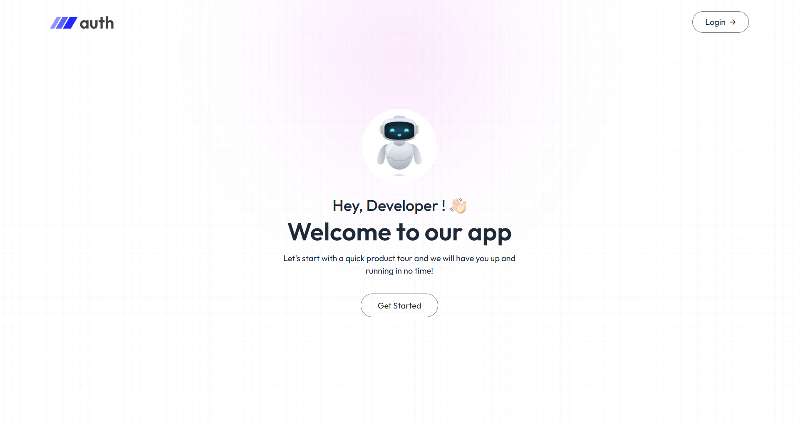
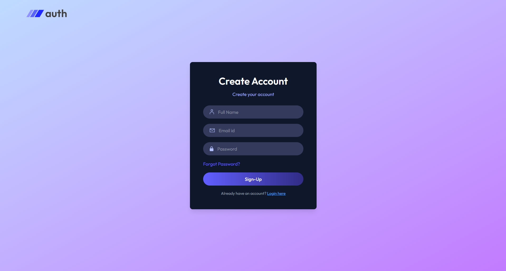
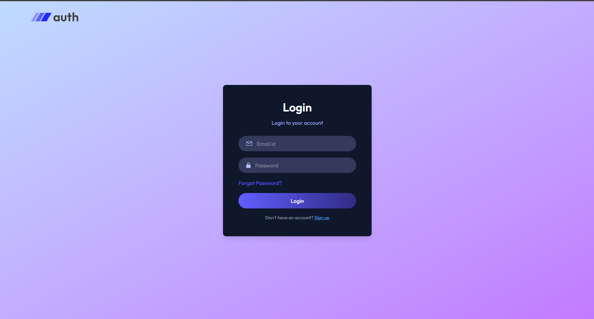
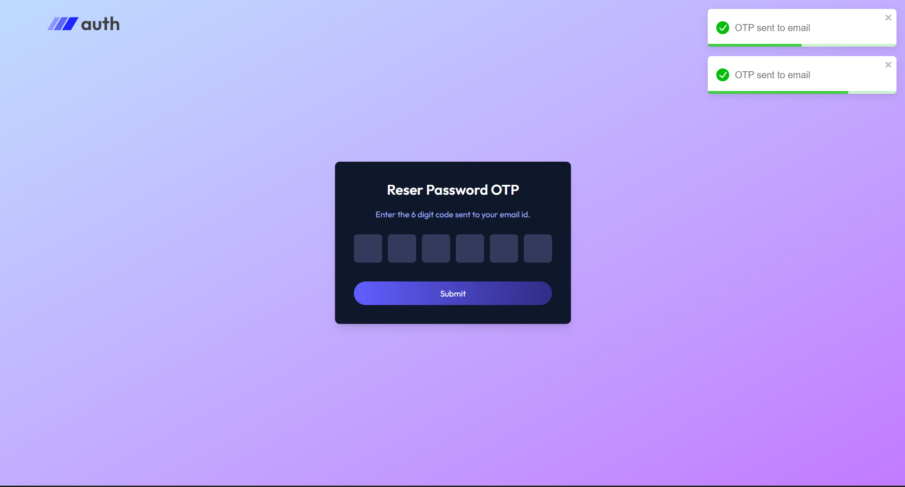

# MERN Authentication System
A full-featured authentication system built with the MERN stack that includes:
- ✅ Login & Registration
- 📧 Email Verification via OTP
- 🔁 Password Reset via Email OTP
- 🔐 JWT-based Authentication
 Built using MongoDB, Express.js, React.js, Node.js, and Tailwind CSS.

---

## 🚀 [Live Demo](https://user-authentication-zeta.vercel.app/)


## 🌟 Features

- User Registration with email verification
- Secure Login using JWT tokens
- Send 6-digit OTP to email for verification
- Forgot Password + Password Reset via OTP
- Reusable React components with Tailwind styling
- Protected routes and token-based auth system

---


## 🛠️ Tech Stack

**Frontend:**  
- React.js  
- Tailwind CSS  
- Axios

**Backend:**  
- Node.js  
- Express.js  
- MongoDB (Mongoose)  
- Nodemailer  
- JSON Web Tokens (JWT)  
- dotenv

---

## 📸 Screenshots

### 🏠 Home Page


### 📦 Register user Page


### 🛒 Login user Page


### 🔐 Password reset 


### 🔐 Email verification 


## Installation

Follow the steps below to set up the project locally:

### 1. Clone the repository
```bash
git clone https://github.com/jaineet06/User_Auth.git
cd User_Auth
```
### 2. Install server dependencies
```bash
cd backend
npm install
```
### 3. Install client dependencies
```bash
cd ../frontend
npm install
```
### 4.  Create environment files
#### backend/.env
```bash
PORT=4000

MONGODB_URL=your_mongodb_connection_string
# ➤ Get it from https://cloud.mongodb.com

JWT_SECRET=your_jwt_secret
# ➤ Generate securely using https://randomkeygen.com

SMTP_USER=your_smtp_email
SMTP_PASSWORD=your_smtp_password
SMTP_SENDER=your_verified_sender_email
# ➤ Sign up and get credentials from https://www.brevo.com (formerly Sendinblue)
```
#### frontend/.env
```bash
VITE_API_URL=http://localhost:4000
````

### 6.  Run the application
####  Start the frontend
```bash
cd frontend
npm run dev
```

####  Start the backend
```bash
cd backend
npm run server
```

## 📧 Connect With Me

Let's discuss the project! Reach out on:
- LinkedIn: [Jaineet Shah](https://www.linkedin.com/in/jaineet-shah-5894a731b)
